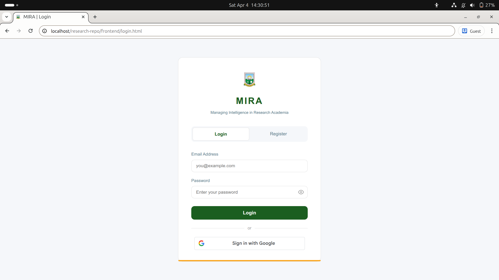
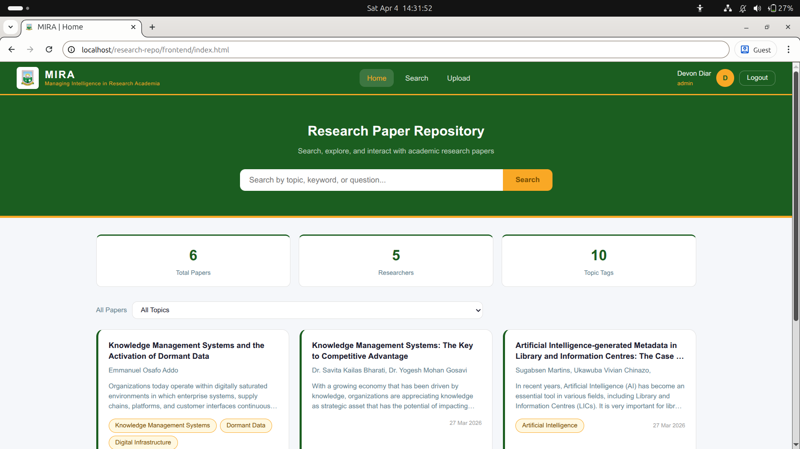
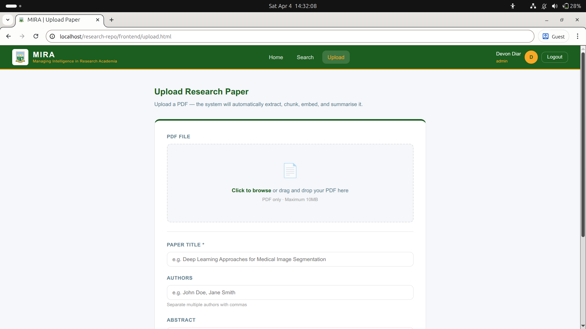
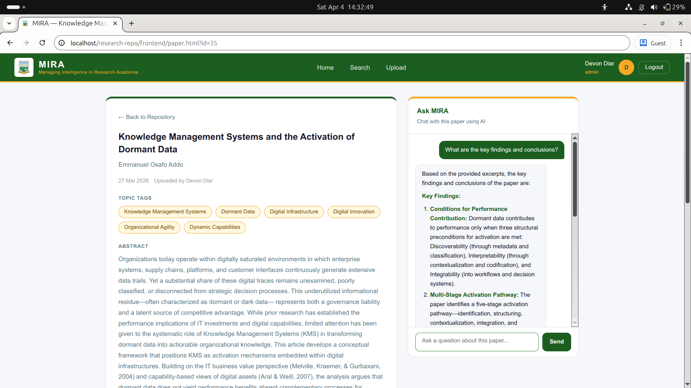

# MIRA — Managing Intelligence in Research Academia

A web-based Knowledge Management System for uploading, searching, and chatting with academic research papers using AI (Gemini API + RAG).


## Features
📄 Upload and manage research papers (PDF)
🔍 AI-powered semantic search across papers
💬 Chat with individual papers using RAG (Retrieval-Augmented Generation)
🔐 User authentication with roles (Student, Lecturer, Admin)
🔑 Google OAuth login support


## Tech Stack

**-Frontend:** HTML, CSS, JavaScript\
**-Backend:** PHP\
**-Database:** MySQL\
**-AI**: Google Gemini API (chat + embeddings)
**-Auth:** JWT + Google OAuth


## Local Setup Instructions

### Requirements
1. [XAMPP](https://www.apachefriends.org) (Apache + MySQL + PHP 8.x)
2. [Composer](https://getcomposer.org)
3. [Gemini API key](https://aistudio.google.com/apikey) (free)
4. [Google OAuth Client ID](https://console.cloud.google.com/apis/credentials) (for Google login)


**1. Clone the repo**

     git clone https://github.com/yourusername/research-repo.git


**2. Place the folder in XAMPP's web root**

     **For Windows**
     C:\xampp\htdocs\MIRA\

     **For Windows**
     Copy this folder to /opt/lampp/htdocs/


**3. Install PHP dependencies**
```bash
cd MIRA
composer install
```

**4. Set up the database**\
     - Start Apache and MySQL in the XAMPP Control Panel
     - Open `http://localhost/phpmyadmin`
     - Create a new database named `mira`
     - Click **Import** and select `mira.sql`

**5. Configure the app**

     Edit `api/config.php` and fill in:
     - Your Gemini API key


**6. Set up Google login (optional)**\
   Edit `frontend/js/auth.js` and replace `your_google_client_id_here` with your actual Google OAuth Client ID.

**7. Open the app**\
     http://localhost/MIRA/frontend/login.html


## Project Structure

research-repo/\
├── api/\
│   ├── config.example.php   ← copy to config.php and fill in your values\
│   ├── auth.php\
│   ├── upload.php\
│   ├── search.php\
│   ├── chat.php\
│   └── helpers/\
├── frontend/\
│   ├── js/\
│   │   └── auth.example.js  ← copy to auth.js and fill in your Google Client ID\
│   ├── css/\
│   └── *.html\
├── uploads/                 ← PDF files stored here (excluded from Git)\
├── database.sql             ← run this once to create all tables\
└── composer.json\

## Screenshots





